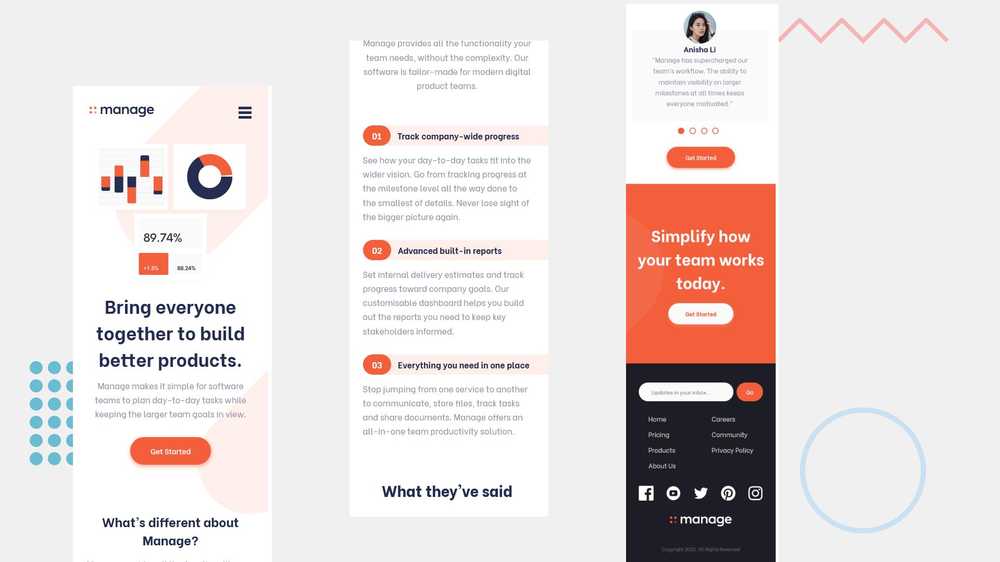

# Frontend Mentor - Manage landing page solution

This is a solution to the [Manage landing page challenge on Frontend Mentor](https://www.frontendmentor.io/challenges/manage-landing-page-SLXqC6P5). Frontend Mentor challenges help you improve your coding skills by building realistic projects. 

## Table of contents

- [Overview](#overview)
  - [The challenge](#the-challenge)
  - [Screenshot](#screenshot)
  - [Links](#links)
- [My process](#my-process)
  - [Built with](#built-with)
  - [Useful resources](#useful-resources)
- [Author](#author)

## Overview

### The challenge

Users should be able to:

- View the optimal layout for the site depending on their device's screen size
- See hover states for all interactive elements on the page
- See all testimonials in a horizontal slider
- Receive an error message when the newsletter sign up `form` is submitted if:
  - The `input` field is empty
  - The email address is not formatted correctly

### Screenshot

### Links

- Solution URL: [Add solution URL here](https://your-solution-url.com)
- Live Site URL: [GitHub Pages](https://sofskrbic.github.io/manage-landing-page/)

## My process

### Built with

- [Vue.js](https://vuejs.org/) - JS library
- Semantic HTML5 markup
- CSS custom properties
- Flexbox
- JavaScript
- Mobile-first workflow

### Useful resources

- [Horizontal scroller](https://jsfiddle.net/jonigiuno/4jwHF/) - This fiddle and Joni's comment on [CSS-Tricks](https://css-tricks.com/forums/topic/horizontal-scrolling-but-only-a-part-of-a-website/#post-135034) have saved me from a lot of headaches. I didn't want to take the easy road and import a library that would do all the heavy lifting (at least, not for things concerning the frontend). I wanted to make the horizontal scroller from scratch and to really understand what's going on under the hood. Joni's example helped tremendeously with that!

## Author

- Linkedin - [@sofskrbic](https://www.linkedin.com/in/sofijaskrbic/)
- Frontend Mentor - [@sofskrbic](https://www.frontendmentor.io/profile/sofskrbic)
- Twitter - [@sofskrbic](https://www.twitter.com/sofskrbic)
